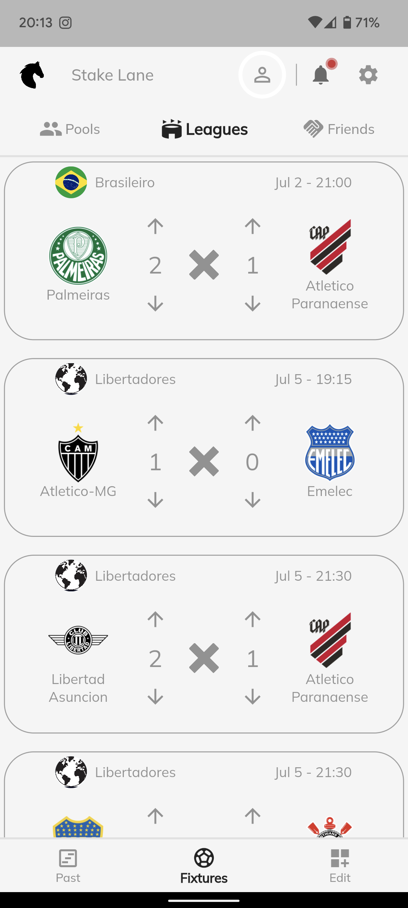
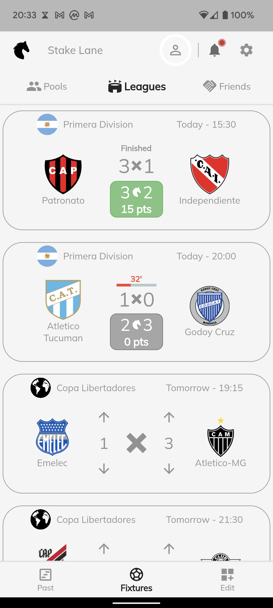
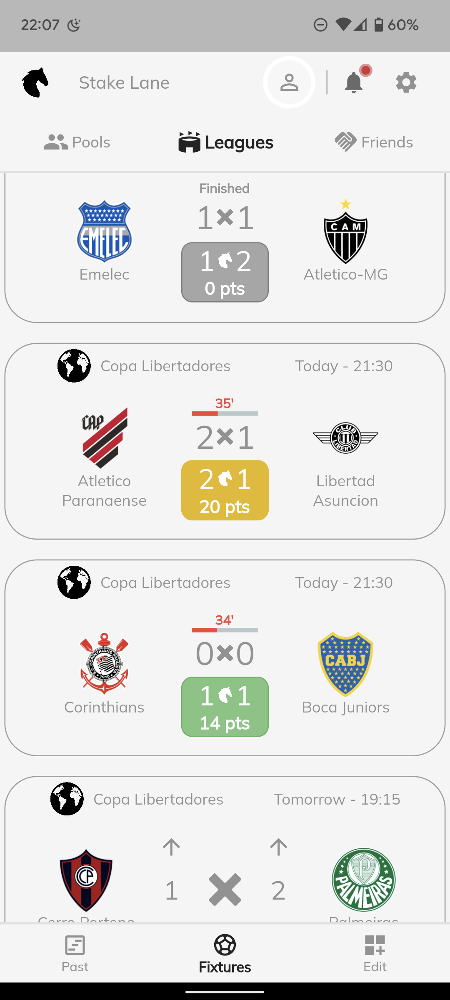

# Stake Lane
Readme generated by LLM

A Flutter-based sports prediction application that allows users to predict match outcomes, compete with friends, and earn points based on their prediction accuracy.


## Overview

Stake Lane is a social sports prediction platform where users can:
- Make predictions on upcoming football matches across various leagues
- Track live match scores and see their predictions in real-time
- Earn points based on prediction accuracy
- Create and join prediction pools with friends
- Compete on leaderboards

## Screenshots

### Match Prediction Interface
<div style="display: flex; gap: 10px;">
  
  
  
</div>

**Features shown:**
- **Predictable Matches**: Use up/down arrows to predict match outcomes before kickoff
- **Live Matches**: Real-time score updates with minute indicators (32', 35', 34')
- **Finished Matches**: Final scores with points earned (color-coded: green for correct, gray for incorrect, yellow for partially correct)

## Architecture


The application follows a multi-tier architecture:
- **Flutter Web/Mobile Apps**: Cross-platform UI for iOS and Android
- **Flutter Admin Panel**: Administrative interface for managing leagues and fixtures
- **Backend API**: Handles business logic, authentication, and data processing
- **Database**: Persistent storage for users, predictions, and match data
- **Push Notifications**: Real-time updates for match events and results

## Features

### Core Functionality
- Match prediction with intuitive up/down voting interface
- Real-time match tracking with live scores
- Points system rewarding prediction accuracy
- Multiple match states: Predictable, Live, and Finished

### Social Features
- **Pools**: Create private prediction leagues with friends
- **Public Pools**: Join community-wide competitions
- **Friends**: Connect with other users and view their predictions
- **Leaderboards**: Track rankings within pools

### League Coverage
- Support for multiple football leagues (Brasileirão, Copa Libertadores, Primera División, etc.)
- Historical match data and past predictions
- Fixture management and scheduling

## Tech Stack

### Frontend
- **Framework**: Flutter 3.0+
- **Language**: Dart 2.17.5+
- **State Management**: GetX (^4.6.5)
- **UI Components**:
  - Google Fonts (Mulish typography)
  - Percent Indicator for visual statistics
  - Auto Size Text for responsive typography
  - Infinite Scroll Pagination for efficient data loading

### Key Dependencies
```yaml
dependencies:
  get: ^4.6.5                           # State management & routing
  google_fonts: ^3.0.1                  # Typography
  intl: ^0.17.0                         # Internationalization & date formatting
  http: ^0.13.4                         # API communication
  percent_indicator: ^4.2.2             # Progress visualization
  infinite_scroll_pagination: ^3.2.0    # Efficient list loading
  auto_size_text: ^3.0.0               # Responsive text sizing
```

## Project Structure

```
lib/
├── api/                    # API integration layer
│   ├── auth/              # Authentication endpoints
│   ├── fixtures/          # Match fixture endpoints
│   └── predictions/       # Prediction management
├── constants/             # App-wide constants
│   ├── style.dart        # Theme and styling constants
│   └── match_status.dart # Match state definitions
├── controllers/           # GetX controllers
│   ├── navigation_controller.dart
│   └── menu_controller.dart
├── pages/                 # Screen components
│   ├── leagues/          # League and fixture views
│   ├── pools/            # Pool management screens
│   ├── friends/          # Social features
│   └── welcome/          # Onboarding screens
├── routing/              # Navigation configuration
├── widgets/              # Reusable UI components
├── helpers/              # Utility functions
├── layout.dart           # Main layout wrapper
└── main.dart             # Application entry point
```

## Getting Started

### Prerequisites
- Flutter SDK (>=2.17.5 <3.0.0)
- Dart SDK
- iOS Simulator / Android Emulator / Physical Device

### Installation

1. Clone the repository:
```bash
git clone https://github.com/yourusername/stake-lane-web-app.git
cd stake-lane-web-app
```

2. Install dependencies:
```bash
flutter pub get
```

3. Run the application:
```bash
flutter run
```

## Development

### Available Make Commands

The project includes a Makefile for convenient development workflows:

```bash
# Web Development
make run-web                    # Run on Chrome
make run-web-local-network     # Run on local network (accessible from mobile devices)

# Mobile Development
make run-physical-wifi-android  # Run on Android device via WiFi
make run-physical-wired-pixel   # Run on Pixel device via USB
make run-physical-wired-xiaomi  # Run on Xiaomi device via USB
make run-virtual-android        # Run on Android emulator
make run-virtual-ios            # Run on iOS simulator
```

### Running on Specific Platforms

#### Web Browser
```bash
flutter run -d chrome
```

#### iOS Simulator
```bash
flutter run -d ios
```

#### Android Emulator
```bash
flutter run -d android
```

### Building for Production

#### Android
```bash
flutter build apk --release
```

#### iOS
```bash
flutter build ios --release
```

#### Web
```bash
flutter build web --release
```

## Match Card States

The application displays matches in three distinct states:

1. **Predictable** (Before Match Start)
   - Up/down arrows for score prediction
   - Match date and time
   - League indicator

2. **Live** (During Match)
   - Current score display
   - Live minute indicator (e.g., "32'")
   - Real-time updates
   - Current prediction status

3. **Finished** (After Match End)
   - Final score
   - Points earned display
   - Color-coded feedback:
     - 🟢 Green: Correct prediction
     - 🟡 Yellow: Partially correct (correct result, wrong score)
     - ⚪ Gray: Incorrect prediction

## Points System

Users earn points based on prediction accuracy:
- **Exact Score**: Maximum points (e.g., 20 pts)
- **Correct Result**: Partial points (e.g., 14 pts)
- **Incorrect**: No points (0 pts)

The points are displayed on finished match cards with color-coded badges.

## Contributing

1. Fork the repository
2. Create your feature branch (`git checkout -b feature/AmazingFeature`)
3. Commit your changes (`git commit -m 'Add some AmazingFeature'`)
4. Push to the branch (`git push origin feature/AmazingFeature`)
5. Open a Pull Request

## License

This project is private and not published to pub.dev.

## Support

For issues, questions, or contributions, please open an issue in the repository.

---

Made with Flutter ❤️
